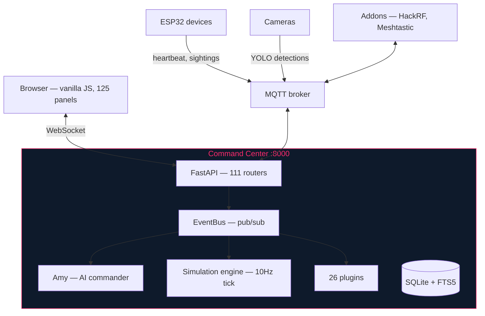
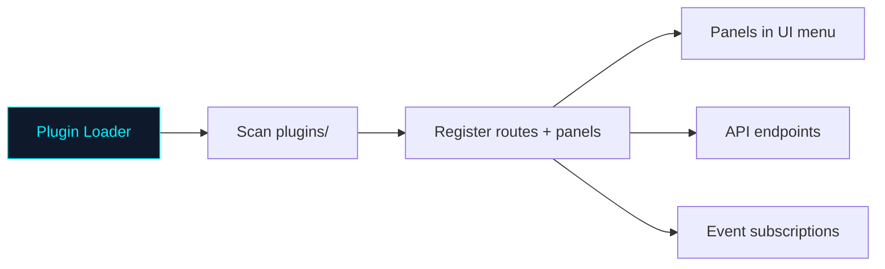

# tritium-sc — Command Center

Web-based tactical dashboard for the Tritium system. Runs on port 8000. Shows a real-world map with live sensor data, AI commander, and 26 plugins.

## How it works



## Quick start

```bash
./setup.sh install    # Create venv, install deps, init database
./start.sh            # Start on :8000
# Open http://localhost:8000

# Run tests
./test.sh fast        # Tiers 1-3 + 8 (~60s)
./test.sh 3           # JS tests only (~3s)
```

## Directory structure

```
tritium-sc/
├── src/
│   ├── app/              FastAPI application
│   │   ├── main.py       Entry point, boot sequence
│   │   ├── routers/      111 REST endpoints (by domain)
│   │   ├── config.py     Pydantic settings
│   │   └── models.py     SQLAlchemy models
│   ├── amy/              AI commander (4-layer cognition)
│   │   ├── commander.py  Main orchestrator
│   │   ├── brain/        Thinking, memory, sensorium
│   │   └── actions/      Motor programs, announcer
│   ├── engine/           System infrastructure
│   │   ├── simulation/   Battle sim (57 files, 10Hz tick)
│   │   ├── comms/        MQTT bridge, event bus, CoT
│   │   ├── tactical/     Threat detection, geo, dossiers
│   │   ├── perception/   Frame analysis, LLM vision
│   │   ├── units/        17 unit types
│   │   └── ...           actions, audio, nodes, layers, inference
│   └── frontend/         Browser UI (no frameworks)
│       ├── unified.html  Command Center (primary)
│       ├── js/command/   125 panel modules
│       └── css/          CYBERCORE cyberpunk theme
├── plugins/              26 plugins (see below)
├── tests/                669 Python + 123 JS test files
├── examples/             Robot templates, ROS2, demos
└── docs/                 Architecture, specs, guides
```

## Plugins

Plugins extend the Command Center with new capabilities. Each plugin can register API routes, UI panels, background tasks, and event handlers.



### Sensor plugins
| Plugin | What it does |
|--------|-------------|
| `acoustic` | Sound classification (gunshot, voice, vehicle, siren) |
| `camera_feeds` | RTSP/USB camera management and YOLO detection |
| `edge_tracker` | BLE presence tracking from ESP32 nodes |
| `indoor_positioning` | WiFi/BLE fingerprint-based indoor location |
| `lpr` | License plate recognition and watchlists |
| `meshtastic_bridge` | LoRa mesh node tracking and messaging |
| `radar_tracker` | Radar target tracking |
| `rf_motion` | RSSI-based motion detection from stationary radios |
| `sdr` | Software-defined radio integration |
| `sdr_monitor` | SDR spectrum monitoring |
| `wifi_csi` | WiFi channel state information |
| `wifi_fingerprint` | WiFi device fingerprinting |
| `yolo_detector` | Real-time object detection |

### Intelligence plugins
| Plugin | What it does |
|--------|-------------|
| `amy` | AI commander personality and cognition |
| `behavioral_intelligence` | Pattern-of-life analysis |
| `gis_layers` | Map overlays (weather, terrain, boundaries) |
| `threat_feeds` | External threat intelligence |

### Simulation plugins
| Plugin | What it does |
|--------|-------------|
| `city_sim` | City simulation (traffic, pedestrians, NPCs) |
| `graphlings` | Autonomous digital life with LLM cognition |

### Operations plugins
| Plugin | What it does |
|--------|-------------|
| `automation` | IF-THEN rule engine |
| `edge_autonomy` | ESP32 autonomous behavior |
| `federation` | Multi-site federation |
| `fleet_dashboard` | Device fleet management |
| `floorplan` | Indoor floorplan editor |
| `swarm_coordination` | Multi-robot coordination |
| `tak_bridge` | ATAK/CoT interoperability |

## Testing

```bash
./test.sh fast           # Quick validation (~60s)
./test.sh all            # Everything (~15 min)
./test.sh 3              # JS tests only
./test.sh 9              # Integration E2E
./test.sh 10             # Visual quality (Playwright + LLM)
```

| Tier | What | Files |
|------|------|-------|
| 1 | Syntax check | 31 |
| 2 | Python unit tests | ~8,830 |
| 3 | JS tests | 119 files, 7,700+ assertions |
| 9 | Integration E2E | 6 |
| 7 | Visual regression | 117 files |

## Where to go next

- [CLAUDE.md](CLAUDE.md) — Full code conventions, API reference, test tiers
- [docs/ARCHITECTURE.md](docs/ARCHITECTURE.md) — System design
- [docs/PLUGIN-SPEC.md](docs/PLUGIN-SPEC.md) — Plugin interface
- [docs/SIMULATION.md](docs/SIMULATION.md) — Sim engine internals
- [docs/HOW-TO-PLAY.md](docs/HOW-TO-PLAY.md) — Player guide
- [plugins/README.md](plugins/README.md) — Plugin details

---

AGPL-3.0 | Copyright 2026 Valpatel Software LLC
