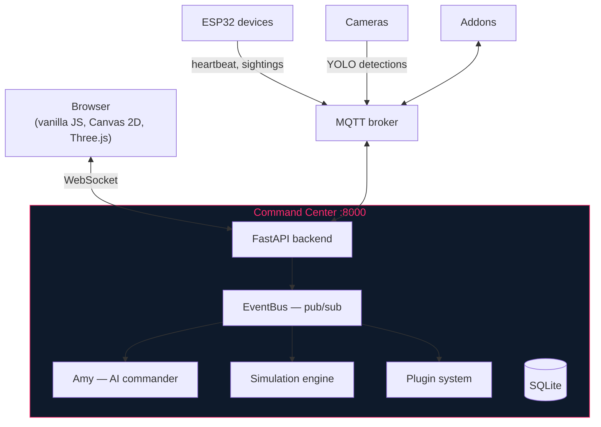
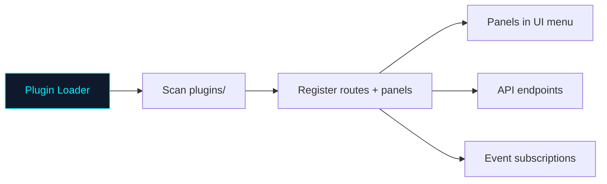

# tritium-sc — Command Center

Web-based tactical dashboard for the Tritium system. Shows a real-world map with live sensor data, plugin-driven UI, and an AI commander named Amy.

## How it works



## Quick start

```bash
./setup.sh install    # Create venv, install deps, init database
./start.sh            # Start on :8000
# Open http://localhost:8000

./test.sh fast        # Quick validation (~60s)
```

## Directory structure

```
tritium-sc/
├── src/
│   ├── app/              FastAPI application
│   │   ├── main.py       Entry point, boot sequence
│   │   ├── routers/      REST endpoints (organized by domain)
│   │   └── config.py     Pydantic settings
│   ├── amy/              AI commander (4-layer cognition)
│   │   ├── commander.py  Main orchestrator
│   │   ├── brain/        Thinking, memory, sensorium
│   │   └── actions/      Motor programs, announcer
│   ├── engine/           System infrastructure
│   │   ├── simulation/   Battle sim (10Hz tick loop)
│   │   ├── comms/        MQTT bridge, event bus, CoT
│   │   ├── tactical/     Threat detection, geo, dossiers
│   │   ├── perception/   Frame analysis, LLM vision
│   │   └── ...           actions, audio, nodes, layers, units
│   └── frontend/         Browser UI (no frameworks)
│       ├── unified.html  Command Center (primary)
│       ├── js/command/   Panel modules
│       └── css/          CYBERCORE cyberpunk theme
├── plugins/              Plugin directory (see below)
├── tests/                Test suite
├── examples/             Robot templates, ROS2, demos
└── docs/                 Architecture, specs, guides
```

## Plugin system

Plugins are how the Command Center grows. Each plugin can register API routes, UI panels, background tasks, and event subscriptions. Drop a new folder in `plugins/` and it's auto-discovered on restart.



### Sensor plugins
| Plugin | What it does |
|--------|-------------|
| `acoustic` | Sound classification (gunshot, voice, vehicle, siren) |
| `camera_feeds` | RTSP/USB camera management and YOLO detection |
| `edge_tracker` | BLE presence tracking from ESP32 nodes |
| `indoor_positioning` | WiFi/BLE fingerprint-based indoor location |
| `lpr` | License plate recognition |
| `meshtastic_bridge` | LoRa mesh node tracking and messaging |
| `radar_tracker` | Radar target tracking |
| `rf_motion` | RSSI-based motion detection from stationary radios |
| `sdr` / `sdr_monitor` | Software-defined radio integration |
| `wifi_csi` / `wifi_fingerprint` | WiFi sensing and device fingerprinting |
| `yolo_detector` | Real-time object detection |

### Intelligence plugins
| Plugin | What it does |
|--------|-------------|
| `amy` | AI commander personality and cognition |
| `behavioral_intelligence` | Pattern-of-life analysis |
| `gis_layers` | Map overlays (weather, terrain, boundaries) |
| `threat_feeds` | External threat intelligence |

### Simulation plugins
| Plugin | What it does |
|--------|-------------|
| `city_sim` | City simulation (traffic, pedestrians, NPCs, protest) |
| `graphlings` | Autonomous digital life with LLM cognition |

### Operations plugins
| Plugin | What it does |
|--------|-------------|
| `automation` | IF-THEN rule engine |
| `edge_autonomy` | ESP32 autonomous behavior |
| `federation` | Multi-site federation |
| `fleet_dashboard` | Device fleet management |
| `floorplan` | Indoor floorplan editor |
| `swarm_coordination` | Multi-robot coordination |
| `tak_bridge` | ATAK/CoT interoperability |

## Testing

```bash
./test.sh fast           # Quick validation (~60s)
./test.sh all            # Everything (~15 min)
./test.sh 3              # JS tests only
./test.sh 9              # Integration E2E (starts a headless server)
./test.sh 10             # Visual quality (Playwright + local LLM)
```

## Where to go next

- [CLAUDE.md](CLAUDE.md) — Code conventions, API reference, test tiers
- [docs/ARCHITECTURE.md](docs/ARCHITECTURE.md) — System design
- [docs/PLUGIN-SPEC.md](docs/PLUGIN-SPEC.md) — Plugin interface
- [docs/SIMULATION.md](docs/SIMULATION.md) — Sim engine internals
- [docs/HOW-TO-PLAY.md](docs/HOW-TO-PLAY.md) — Player guide
- [docs/USER-STORIES.md](docs/USER-STORIES.md) — What the user should experience

---

AGPL-3.0 | Copyright 2026 Valpatel Software LLC
