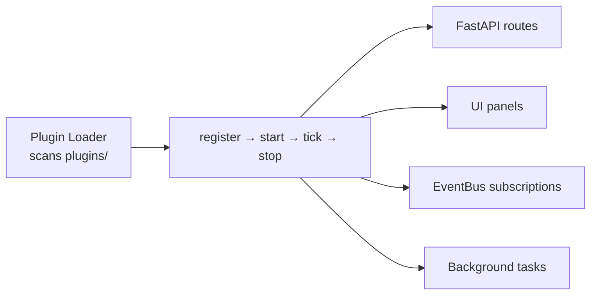

# Plugins

**Where you are:** `tritium-sc/plugins/` — 26 plugins that extend the Command Center.

**Parent:** [../README.md](../README.md) | [../CLAUDE.md](../CLAUDE.md)

## How plugins work

Each plugin directory contains:
- `plugin.py` — Plugin class with lifecycle hooks
- `routes.py` — FastAPI router
- `*_loader.py` — Registers the plugin with the system

## All 26 plugins

### Sensors (13)

| Plugin | What it does | Has README |
|--------|-------------|------------|
| `acoustic/` | Sound classification (gunshot, voice, vehicle, siren) | Yes |
| `camera_feeds/` | Multi-source camera management (RTSP, MJPEG, MQTT, USB, synthetic) | Yes |
| `edge_tracker/` | BLE/WiFi presence tracking from ESP32 nodes | Yes |
| `indoor_positioning/` | WiFi/BLE fingerprint-based indoor location | No |
| `lpr/` | License plate recognition and watchlists | No |
| `meshtastic_bridge/` | LoRa mesh radio — nodes, GPS, messaging | Yes |
| `radar_tracker/` | Radar target tracking | No |
| `rf_motion/` | RSSI-based motion detection from stationary radios | Yes |
| `sdr/` | Software-defined radio integration | No |
| `sdr_monitor/` | SDR spectrum monitoring dashboard | No |
| `wifi_csi/` | WiFi channel state information analysis | No |
| `wifi_fingerprint/` | WiFi device fingerprinting and identification | No |
| `yolo_detector/` | Real-time YOLO object detection pipeline | Yes |

### Intelligence (4)

| Plugin | What it does | Has README |
|--------|-------------|------------|
| `amy/` | AI commander — 4-layer cognition, autonomous decisions | No |
| `behavioral_intelligence/` | Pattern-of-life analysis and anomaly detection | No |
| `gis_layers/` | Map overlays (weather, terrain, boundaries, buildings) | Yes |
| `threat_feeds/` | External threat intelligence (STIX/TAXII matching) | Yes |

### Simulation (2)

| Plugin | What it does | Has README |
|--------|-------------|------------|
| `city_sim/` | City simulation — traffic, pedestrians, NPCs, weather | Yes |
| `graphlings/` | Autonomous digital life with LLM cognition | Yes |

### Operations (7)

| Plugin | What it does | Has README |
|--------|-------------|------------|
| `automation/` | IF-THEN rule engine (9 condition operators, 6 action types) | Yes |
| `edge_autonomy/` | ESP32 autonomous behavior management | No |
| `federation/` | Multi-site target and dossier sharing | Yes |
| `fleet_dashboard/` | Device registry, battery, uptime, sighting counts | Yes |
| `floorplan/` | Indoor floorplan editor and viewer | No |
| `swarm_coordination/` | Multi-robot coordination and dispatch | No |
| `tak_bridge/` | ATAK/CoT interoperability (multicast UDP, TCP, MQTT) | Yes |

Note: `npc_thoughts.py` is a standalone file (not a directory plugin) that generates NPC thought bubbles.

## Related docs

- [../docs/PLUGIN-SPEC.md](../docs/PLUGIN-SPEC.md) — Plugin specification and development guide
- [../src/engine/plugins/](../src/engine/plugins/) — Plugin loader infrastructure
- [../../tritium-lib/src/tritium_lib/sdk/](../../tritium-lib/src/tritium_lib/sdk/) — Addon SDK (shared with addons)
