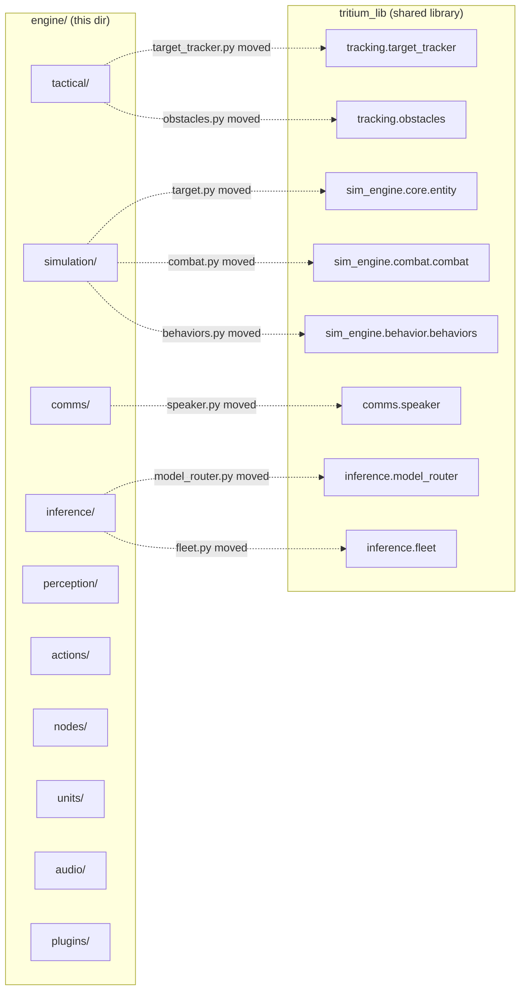

# Engine — System Infrastructure

**Where you are:** `tritium-sc/src/engine/` — the commander-agnostic system infrastructure that powers the Command Center.

**Parent:** [../README.md](../README.md) | [../../CLAUDE.md](../../CLAUDE.md)

> **Note:** Many core modules moved to `tritium-lib` during the Wave 186 refactor. SC now imports these from `tritium_lib.*`. See the migration diagram below.

## What Moved vs. What Stayed



## Subsystems

```
engine/
├── commander_protocol.py     # Interface for swappable commanders
├── simulation/               # 10Hz battle simulation engine
│   ├── engine.py             # SimulationEngine — main tick loop, hostile spawner
│   ├── game_mode.py          # GameMode — 10-wave progression, scoring
│   ├── behavior/             # Behavior trees and unit AI state machines
│   ├── npc_intelligence/     # NPC personality, cognition, crowd dynamics
│   ├── ambient.py            # AmbientSpawner — neutral civilian activity
│   ├── combat_bridge.py      # Bridge to tritium_lib CombatSystem
│   ├── loader.py             # TritiumLevelFormat JSON parser
│   └── (30+ more modules)    # replay, morale, swarm, terrain, pursuit, etc.
├── comms/                    # Communication: EventBus, MQTT, CoT, TAK
│   ├── event_bus.py          # Shim → tritium_lib QueueEventBus
│   ├── mqtt_bridge.py        # MQTT broker bridge for device mesh
│   ├── listener.py           # Audio VAD + recording (Silero VAD)
│   ├── cot.py / mqtt_cot.py  # Cursor on Target protocol
│   └── tak_bridge.py         # TAK/ATAK server bridge
├── tactical/                 # Geo, threat classification, dossiers
│   ├── escalation.py         # ThreatClassifier (2Hz) + AutoDispatcher
│   ├── geo.py                # Server-side geo-reference and coordinate transforms
│   ├── street_graph.py       # OSM road extraction + A* pathfinding
│   ├── dossier_manager.py    # Target dossiers + enrichment
│   └── (20+ more modules)    # geofence, forensics, network analysis, etc.
├── inference/                # LLM-powered reasoning
│   └── robot_thinker.py      # LLM-powered autonomous robot thinking
├── perception/               # Frame analysis, vision, fact extraction
│   ├── perception.py         # Layered quality gate, complexity, motion detection
│   ├── vision.py             # LLM chat API wrapper for visual reasoning
│   └── extraction.py         # Fact extraction from conversation
├── actions/                  # Lua dispatch & formations
├── nodes/                    # Sensor node abstraction (cameras, PTZ, mics)
├── units/                    # 17 unit types (robots, people, sensors)
├── audio/                    # Sound effects library and audio pipeline
├── intelligence/             # Intelligence analysis modules
├── synthetic/                # Procedural media generation
├── scenarios/                # Behavioral test framework
├── layers/                   # Map/GIS layer system
├── layouts/                  # Level format JSON files
├── plugins/                  # Plugin loader and registration
└── testing/                  # Test utilities
```

## Modules That Moved to tritium-lib

| Was in engine/ | Now import from | Purpose |
|----------------|-----------------|---------|
| `simulation/target.py` | `tritium_lib.sim_engine.core.entity` | SimulationTarget dataclass |
| `simulation/combat.py` | `tritium_lib.sim_engine.combat.combat` | CombatSystem — projectile flight, hit detection |
| `simulation/behaviors.py` | `tritium_lib.sim_engine.behavior.behaviors` | UnitBehaviors — turret, drone, rover AI |
| `comms/speaker.py` | `tritium_lib.comms.speaker` | TTS output (Piper) |
| `tactical/target_tracker.py` | `tritium_lib.tracking.target_tracker` | Unified target registry |
| `tactical/obstacles.py` | `tritium_lib.tracking.obstacles` | Building obstacles for pathfinding |
| `inference/model_router.py` | `tritium_lib.inference.model_router` | Task-aware LLM model selection |
| `inference/fleet.py` | `tritium_lib.inference.fleet` | Multi-host LLM fleet discovery |

## Testing

```bash
.venv/bin/python3 -m pytest tests/engine/ -v            # All engine tests
.venv/bin/python3 -m pytest tests/engine/simulation/ -v  # Simulation only
.venv/bin/python3 -m pytest tests/engine/comms/ -v       # Comms only
.venv/bin/python3 -m pytest tests/engine/tactical/ -v    # Tactical only
```

## Related

- [../amy/](../amy/) — Amy AI commander (implements CommanderProtocol)
- [../app/](../app/) — FastAPI backend that wires engine to HTTP/WS
- [../../docs/SIMULATION.md](../../docs/SIMULATION.md) — Simulation engine design
- [../../docs/ESCALATION.md](../../docs/ESCALATION.md) — Threat escalation state machine
- [../../docs/MQTT.md](../../docs/MQTT.md) — MQTT topic hierarchy
